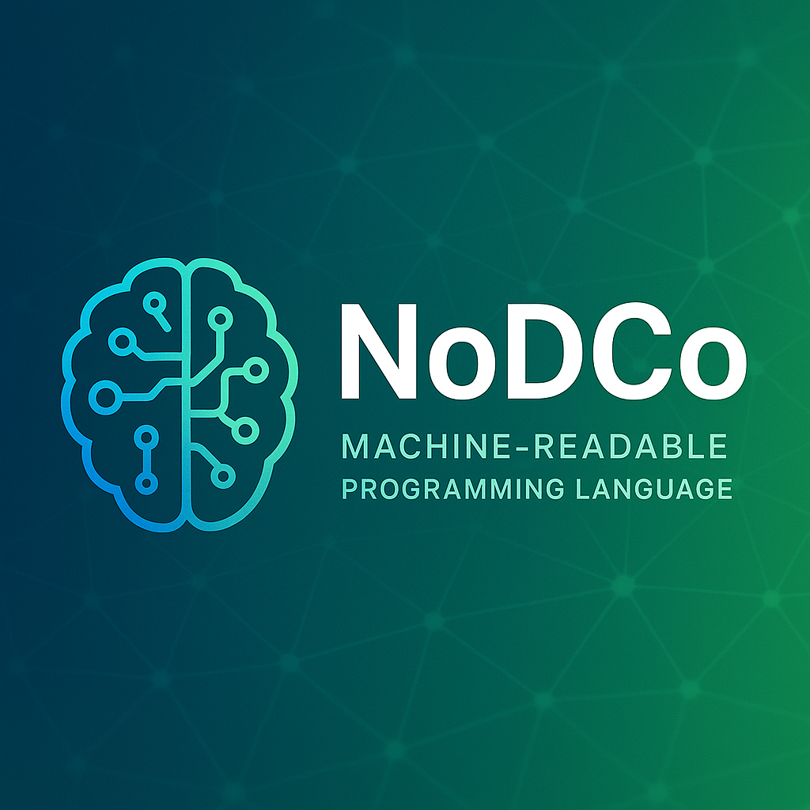

# NodeCo

<p align="center">
  
</p>

NodeCo is an AI-friendly, multiplatform, binary programming language designed for seamless AI parsing, code generation, and execution. It supports basic programming constructs, advanced UI creation, event handling, and is easily extensible for future features like cloud updates and mobile support.

## Features
- **AI-first binary format** (.kbj files)
- **Cross-platform VM and compiler** (Windows, with plans for more)
- **Rich UI creation** (buttons, labels, inputs, layouts)
- **Event handling** (click, change, etc.)
- **Styling and layout** (width, height, color, containers)
- **Cloud update and extensibility**
- **Easy integration with AI tools and prompt-based code generation**

## Documentation
- [Language Specification](https://github.com/Ikolvi/NodeCo/blob/main/language_spec/ai_lang_spec.md)
- [AI Features & Prompt Guide](https://github.com/Ikolvi/NodeCo/blob/main/NodeCo_AI_Features.md)
- [Example Programs](https://github.com/Ikolvi/NodeCo/tree/main/language_spec/examples)

> **Tip:** AI tools can use these HTTP URLs to access up-to-date documentation and examples for NodeCo.

## Quick Start
1. Build the VM and compiler:
   ```sh
   cd vm && cargo build --release
   cd ../compiler && cargo build --release
   ```
2. Run a NodeCo program:
   ```sh
   vm.exe path\to\yourfile.kbj
   ```

## Contributing
We welcome contributions from everyone! To get started:

- Fork the repository and create your branch from `main`.
- If you’ve added code, add tests.
- If you’ve changed APIs, update the documentation.
- Ensure your code builds and passes all tests.
- Open a pull request with a clear description of your changes.

### Pull Requests
- Please keep pull requests focused and atomic.
- Reference related issues in your PR description.
- Use clear, descriptive commit messages.
- Be respectful and constructive in code reviews and discussions.

For more details, see the [CONTRIBUTING.md](https://github.com/Ikolvi/NodeCo/blob/main/CONTRIBUTING.md) if available, or open an issue to ask questions. 